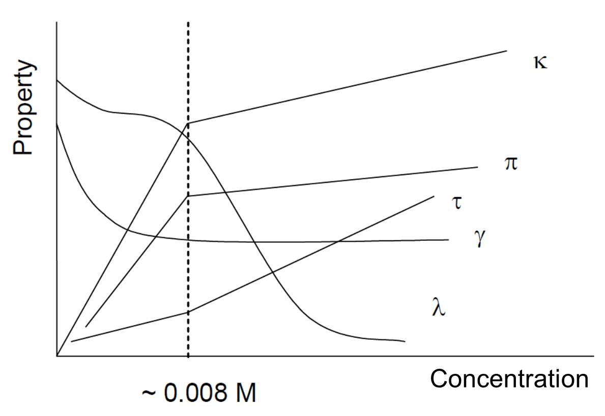

Micelles which are aggregates of amphiphilic or amphipathic (surfactant) molecules find applications in many areas like chemistry, biology, pharmacy, and industry. When the concentration of an amphipathic or surfactant molecule in an aqueous solution is increased, above a particular concentration (or more precisely above a very narrow concentration range), molecular aggregates, called micelles begin to form. This concentration (or more precisely the narrow concentration range) is known as the critical micelle concentration (CMC). The CMC value in a given solvent is characteristic of the surfactant but depends on several other factors, because micellisation is influenced by thermal and electrostatic forces. Therefore, the values of CMCs depend on many factors like the carbon chain (tail) length, chain branching, number of C=C bonds, various types of additives, temperature and pressure. CMC decreases with increasing hydrocarbon chain-length. An addition of strong electrolyte to ionic surfactant tends to decrease the CMC. On the other hand, chain branching and addition of C=C bonds tend to increase the CMC. Determination of the CMC is important in order to understand the self-organizing behaviours of surfactants in solutions. The CMC is a useful physicochemical characteristic for many biologically active substances and drugs. Thermodynamic properties like standard Gibbs free energy change of micelle formation can be calculated if CMC values are known. 

Figure 1. Graphical illustration shows the changes in some (given below) properties of the surfactant, SDS, solution as the function of SDS concentration. Properties: κ: conductivity, π: osmotic pressure, τ: turbidity, γ: surface tension, and λ: equivalent conductivity of SDS solution. Broken vertical line indicates the CMC value.

To determine the critical micelle concentration (CMC) of an ionic surfactant, sodium dodecylsulphate (SDS).

